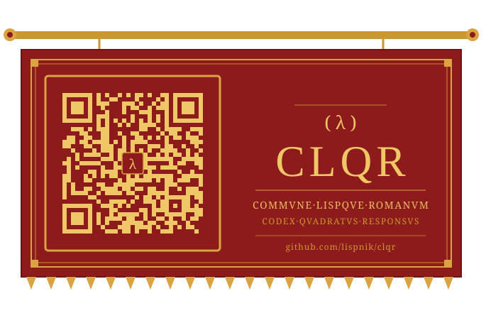

# clqr

[](https://github.com/lispnik/clqr/actions/workflows/ci.yml)
[](#development)

<p align="center">
  
</p>

A pure Common Lisp **QR Code encoder** for Model 2 and Micro QR symbols,
following [ISO/IEC 18004](https://www.iso.org/standard/83389.html) (the current
edition is 2024; the symbology clqr implements is unchanged from the 2015 tables
it is validated against).

`clqr` has no external dependencies for its core: it computes the entire symbol —
Galois field arithmetic, Reed-Solomon error correction, block interleaving,
function-pattern placement, data masking and penalty scoring — in portable
Common Lisp. It cleanly separates the **model** (the abstract QR symbol) from the
**display** (renderers), and ships a command line driver that exposes the whole
API.

- Versions **1–40**, error correction levels **L / M / Q / H**.
- Modes **Numeric**, **Alphanumeric**, **Byte** (ISO-8859-1 / UTF-8) and
  **Kanji** (Shift-JIS), plus **ECI**.
- **Optimal mixed-mode segmentation** — the input is split into Numeric,
  Alphanumeric, Byte and Kanji runs to minimise the encoded size (so Japanese
  text auto-selects the compact Kanji mode), or force a single mode.
- Minimal-version selection, or force a version.
- Automatic **ECI 26 (UTF-8)** header when byte content isn't Latin-1, so the
  symbol is self-describing rather than relying on the reader to guess.
- All eight data masks with ISO penalty scoring (or force a mask).
- **FNC1** (GS1 and AIM) headers and **Structured Append** (multi-symbol) sequences.
- **Micro QR** (M1–M4) via `encode-micro`.
- Renderers: **Unicode/ASCII** text, **SVG**, and **netpbm PBM** (P1 and P4).

### Micro QR

```lisp
(clqr:encode-micro "01234567")                     ; smallest fitting M1-M4
(clqr:encode-micro "HELLO" :version 3 :error-correction :m)
```

`encode-micro` returns a `qr-code` with `qr-micro-p` true; the renderers work
unchanged. Micro QR has error levels `:l :m :q` (no `:h`; M1 is error-detection
only, `:l`), versions 1–4 (M1–M4), and does not support ECI, FNC1 or Structured
Append. On the CLI, add `--micro`.

You can also build segments by hand for full control (see `encode-segments` below).

```
  █▀▀▀▀▀█ ▄▄█ ▀ █▀▀▀▀▀█
  █ ███ █   █ █ █ ███ █
  █ ▀▀▀ █ ▀▄██▀ █ ▀▀▀ █
  ▀▀▀▀▀▀▀ ▀ ▀ ▀ ▀▀▀▀▀▀▀
  ▀▄█▄█ ▀ ▄▀ ▄▀   █  ▀▄
  ▄▄▄█▀█▀██▀ █▄▄▀▄▀█▄▄
   ▀  ▀▀▀▀▄▀▄▀  █▀▀ █ █
  █▀▀▀▀▀█  ▄▄ ▀ ▄█ █▀
  █ ███ █ ▀▀▄▄▀▄▀█▀▀▀█▀
  █ ▀▀▀ █ ▀▀▀█▄█▀▀ █ ▄█
  ▀▀▀▀▀▀▀ ▀▀ ▀ ▀▀▀    ▀
```

## Model and display

The two halves are deliberately independent:

- **Model** — `clqr:encode` returns a `clqr:qr-code`, a plain data object holding
  the version, error correction level, chosen mask, modes used, and the module
  bit-matrix. It knows nothing about output. Read it with `clqr:qr-version`,
  `clqr:qr-mask`, `clqr:qr-size`, `clqr:qr-module` and `clqr:map-modules`.
- **Display** — the `clqr.render` package turns any `qr-code` into an external
  representation and only uses the model's public readers. Add your own renderer
  without touching the encoder.

## Installation

`clqr` is distributed with [ocicl](https://github.com/ocicl/ocicl):

```sh
ocicl install clqr
```

Then load it with ASDF:

```lisp
(asdf:load-system "clqr")
```

The core system `clqr` has no dependencies. The command line system `clqr/cli`
additionally uses [clingon](https://github.com/dnaeon/clingon); the test system
`clqr/test` uses [FiveAM](https://github.com/lispci/fiveam).

## Library usage

```lisp
;; Encode; the model is separate from any rendering.
(let ((qr (clqr:encode "HELLO WORLD" :error-correction :q)))
  (clqr:qr-version qr)          ; => 1
  (clqr:qr-mask qr)             ; => an integer 0-7
  (clqr:qr-size qr)             ; => 21 (modules per side)
  (clqr:qr-module qr 0 0)       ; => T   (dark module at row 0, col 0)

  ;; Render the model however you like.
  (clqr.render:render-text qr)                         ; to *standard-output*
  (with-open-file (s "hello.svg" :direction :output :if-exists :supersede)
    (clqr.render:render-svg qr :stream s :module-size 10)))
```

### `clqr:encode`

```lisp
(clqr:encode content &key (error-correction :m) version mask mode eci)
```

| Argument            | Meaning                                                             |
|---------------------|--------------------------------------------------------------------|
| `content`           | a string, or a sequence of `(unsigned-byte 8)` for byte mode       |
| `:error-correction` | `:l` `:m` `:q` `:h` (default `:m`)                                  |
| `:version`          | force `1`–`40`, or `nil` for the smallest that fits                 |
| `:mask`             | force `0`–`7`, or `nil` to select the lowest-penalty mask          |
| `:mode`             | force `:numeric` `:alphanumeric` `:byte` `:kanji`, or `nil` (auto) |
| `:eci`              | an ECI assignment number to prefix, or `nil`                       |
| `:fnc1`             | `:gs1`, `(:aim N)`, or `nil` — prefix an FNC1 header               |

For mixed-mode content, build segments explicitly and use `clqr:encode-segments`:

```lisp
(clqr:encode-segments
  (list (clqr:make-alphanumeric-segment "HELLO ")
        (clqr:make-byte-segment "world!"))
  :error-correction :h)
```

### Structured Append

Split a long message across several linked symbols (2–16); the result is a list
of `qr-code` objects that a reader can reassemble:

```lisp
(clqr:encode-structured-append "…a long message…" :count 3 :error-correction :m)
;; => (#<QR-CODE> #<QR-CODE> #<QR-CODE>)
```

### Renderers

```lisp
(clqr.render:render-text qr &key (stream *standard-output*) (quiet-zone 4)
                                 (style :unicode) invert)
(clqr.render:render-svg  qr &key (stream *standard-output*) (quiet-zone 4)
                                 (module-size 8) (foreground "#000000")
                                 (background "#ffffff"))
(clqr.render:render-pbm  qr &key (stream *standard-output*) (quiet-zone 4)
                                 (module-size 1) (format :p4))
```

`render-pbm` with `:format :p4` writes raw bytes and needs a binary stream;
`:p1` and the other renderers write to a character stream.

## Command line

Build the binary (dumped with `asdf:make` / `program-op`):

```sh
make            # produces bin/clqr
```

```sh
# Print to the terminal
clqr "HELLO WORLD"

# SVG at error correction level H
clqr -e h -f svg -o hello.svg "https://github.com/lispnik/clqr"

# Force numeric mode and version 4
clqr -M numeric -V 4 123456789

# Read content from standard input, write a PBM image
printf 'hi' | clqr -f pbm -o hi.pbm -
```

Run `clqr --help` for the full option list. Every option maps onto an `encode`
or renderer argument, so the CLI covers the complete API surface. A one-line
summary (version, EC level, mask, size) is written to standard error so standard
output stays clean for piping.

> Terminal note: the default text style draws dark modules as filled blocks,
> which scans correctly on a light background. On a dark-background terminal add
> `--invert`.

## Development

```sh
make deps     # ocicl install (restore clingon + fiveam)
make test     # run the FiveAM suite
make coverage # run the suite under sb-cover -> coverage/cover-index.html
make          # build bin/clqr
make clean    # remove bin/ and this tree's fasl cache
```

The test suite checks against the ISO/IEC 18004 Annex worked example (numeric
`01234567`, version 1-M), the format and version information tables, and golden
full-symbol matrices (standard and Micro QR) cross-checked with an independent
decoder. `make coverage` reports ~88% expression coverage of the core (the
coverage badge is a manual snapshot of that number).

## License

MIT © Matthew Kennedy. See [LICENSE](LICENSE).
